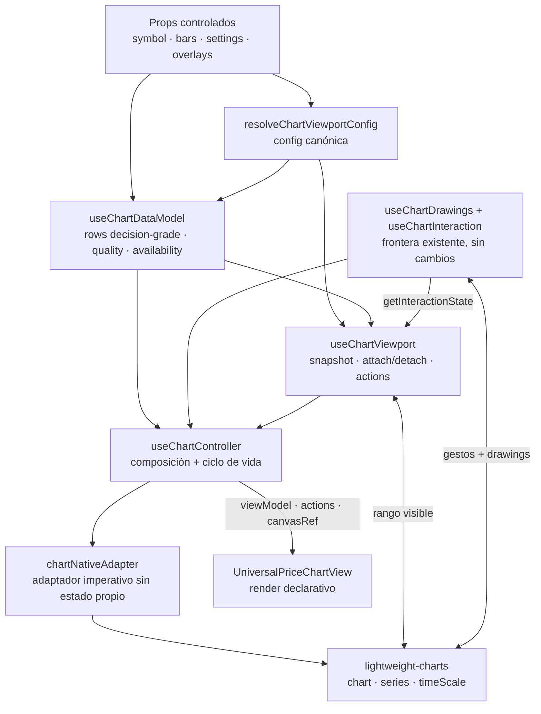

# ADR — Extracción del chart controller (data model + viewport state)

- **Fecha:** 2026-07-14
- **Estado:** Propuesto; decisión cerrada para revisión de Alejandro y ejecución posterior por MiniMax M3
- **Base revisada:** `codex/statsedge-ui-polish` @ `805a2dc`
- **Alcance:** extraer las fronteras de modelo de datos y estado de viewport, y componerlas con la frontera de interacción ya existente. Sin funcionalidad nueva.
- **Fuera de alcance:** persistencia, señales nuevas, replay, Camino A, `ESMA_FIRDS_ENABLED`, cambios en `app/api/chart/route.js` y rediseño de `app/useChartInteraction.js` / `lib/chartInteractionMachine.js`.

---

## 0. Hechos verificados que condicionan la decisión

**H1 — Hay dos tipos de “rango” y no son el mismo estado.** `settings.range` (`6M`, `1A`, `MAX`, etc.) decide qué histórico se solicita/recorta. `timeScale.getVisibleLogicalRange()` describe qué ventana ve el usuario dentro de ese histórico. En este ADR se llaman, respectivamente, **`dataRange`** y **`visibleLogicalRange`**. No se permite volver a nombrar ambos simplemente `range` dentro de los módulos nuevos.

**H2 — El chart nativo cambia el rango sin pasar por React.** Pan y pinch son ejecutados por `lightweight-charts`; durante esos gestos la librería muta su `timeScale` directamente. Intentar que un estado React sea autoridad en cada movimiento crearía un bucle nativo → React → nativo, con riesgo de saltos, realimentación y pérdida de frames.

**H3 — La ventana manual ya tiene una política de restauración probada.** `lib/chartNavigation.js` conserva primero la ventana temporal y usa el rango lógico reescalado como fallback. Se restaura en recreaciones del mismo símbolo y se resetea al cambiar de símbolo o cuando la vista era automática. Esta política se mueve detrás de una API; no se reinterpreta.

**H4 — El fetch y el fallback no son detalles que deba conocer la vista.** Hoy `UniversalPriceChart.jsx` distingue `remote.bars`, `remote.quality`, `localRows`, `needsRemote`, `chartEstimated`, loading y error. Esa elección completa pertenece a una sola frontera que debe devolver una serie final o un estado de disponibilidad, no piezas para que el consumidor vuelva a resolverla.

**H5 — El P0 de calidad impone una invariante, no una preferencia visual.** Una serie `estimated` o `missing` no puede llegar a velas, líneas, medias, volumen ni overlays calculados como si fuera decision-grade. El refactor debe preservar exactamente el bloqueo actual, incluido el camino local de `company-brief` que perdió el flag `estimated` por barra al pasar por `compactChartBars`.

**H6 — “Decision-grade” y “candle-grade” son validaciones distintas.** `quality.status === "real"` autoriza el uso decisional. `barsAreCandleGrade` determina si una serie real tiene OHLC suficiente para dibujar velas coherentes. Una serie real close-only puede usarse en línea/área, pero no en candlestick. No se fusionan ambos conceptos.

**H7 — La interacción ya tiene dueño y contrato.** `lib/chartInteractionMachine.js` + `app/useChartInteraction.js`, consumidos hoy por `app/useChartDrawings.js`, son la frontera verificada para `idle/armed/drawing/editing/panning/pinching`, `NATIVE_GESTURES_ON/OFF` y `DETACH`. Este ADR la compone **sin moverla, disolverla ni añadirle eventos**.

**H8 — Crear/eliminar el chart es una responsabilidad diferente de poseer su viewport.** El controller debe poseer la vida del objeto nativo y de sus series. El viewport recibe un handle no propietario mientras está adjunto y es el único que puede convertir el rango visible en estado semántico o mutarlo. Drawings conserva su lectura geométrica existente para actualizar la primitiva, sin tomar decisiones de viewport. Esta separación evita que `chartRef` vuelva a convertirse en un acceso lateral compartido.

---

## 1. Decisión en una frase

Crear un `useChartController` como único compositor: consume un `useChartDataModel` que nunca expone filas no decision-grade, un `useChartViewport` que replica y restaura el `timeScale` sin competir con él, y la API de interacción existente tal cual; `UniversalPriceChart.jsx` queda como wrapper de un hook y vista declarativa, sin fetch, effects de chart ni llamadas directas a `timeScale`.

---

## 2. Mapa de ownership e invariantes

| Recurso / decisión | Dueño único | Puede leerlo | Prohibido fuera del dueño |
|---|---|---|---|
| Fetch de `/api/chart`, aborto y respuesta vigente | `useChartDataModel` | Nadie directamente | Estado `remote`, `needsRemote`, request keys |
| Normalización, agregación, recorte y elección de filas | `lib/chartDataModel.js` | `useChartDataModel` | Re-resolver fallback en controller/vista |
| Aplicación del guard decision-grade al chart | `lib/chartDataModel.js` | Controller recibe solo el resultado | Pasar raw bars a series o indicadores |
| Clasificación canónica `real/estimated/missing` | `lib/chartDataQuality.js` | Data model y otras superficies de confianza | Predicados ad hoc nuevos |
| `dataRange`, intervalo, estilo, escala e indicadores normalizados | `resolveChartViewportConfig` | Data model, viewport y controller | Defaults duplicados en componentes |
| Rango visible vivo durante attach | `timeScale` nativo | `useChartViewport`, lectura geométrica de drawings | Un segundo estado que lo sobrescriba durante gestos |
| Snapshot semántico/restaurable del viewport | `useChartViewport` | Controller/vista por API | Refs paralelas en controller o vista |
| Comandos de pan/zoom/reset/latest y wheel de trackpad | `useChartViewport` | Vista vía `actions` | Llamadas directas a `setVisibleLogicalRange` |
| Arbitraje pointer y `handleScroll`/`handleScale` | Frontera de interacción existente | Controller consulta `getState()`; drawings la consume | Reimplementar listeners o transiciones |
| Creación/eliminación de chart y series | `useChartController` | Adaptador nativo por delegación | Que data model/viewport llamen `chart.remove()` |
| Primitiva y store de trendlines | `useChartDrawings` existente | Controller vía su API pública | Absorberlos en viewport o data model |
| JSX y accesibilidad de la superficie | `UniversalPriceChartView` | — | Fetch, effects, refs nativas o lógica de calidad |

Invariantes que deben quedar expresadas en tests:

1. `dataModel.rows.length > 0` implica `dataModel.quality.status === "real"`.
2. Ninguna serie nativa recibe barras distintas de `dataModel.rows` o proyecciones puras derivadas de ellas.
3. Mientras el viewport está `attached`, una lectura de “qué se ve ahora” consulta primero el `timeScale`; el snapshot React es una réplica publicada, no un comando pendiente.
4. Solo `useChartViewport` llama `fitContent`, `scrollToRealTime`, `setVisibleLogicalRange` o mantiene subscriptions con significado de viewport. `useChartDrawings` conserva únicamente su subscription geométrica existente para alimentar `TrendlinePrimitive`; no publica estado ni muta el rango.
5. Solo interacción aplica `NATIVE_GESTURES_ON/OFF`; viewport nunca modifica `handleScroll` ni `handleScale`.
6. Solo el controller crea y elimina el chart. `detach` de las fronteras no llama `chart.remove()`.

---

## 3. Frontera 1 — Modelo de datos

### 3.1 Decisión de estructura

Se separan una pieza pura y un adaptador React, replicando el patrón que funcionó para interacción:

- **`lib/chartDataModel.js`**: normalización, agregación, cálculo de necesidad de ampliar histórico y resolución determinista de una snapshot. Sin React, DOM ni red.
- **`app/useChartDataModel.js`**: posee el `AbortController`, la generación/request key vigente y el estado del request; llama a `getJson` y entrega sus resultados al resolver puro.
- **`lib/chartDataQuality.js`** sigue siendo el clasificador canónico P0. No se copia ni se mueve su lógica.

`normalizeRows`, `aggregateRows`, `chartRangeRows` y `shouldRequestRemoteBars` salen de `UniversalPriceChart.jsx` y pasan a la pieza pura sin cambios de semántica. En esta extracción no se añaden deduplicación de timestamps, nuevos proveedores ni nuevos reintentos.

### 3.2 Decisión sobre el guard de calidad

**El enforcement vive dentro del data model.** El módulo puede inspeccionar fuentes crudas, pero su API pública nunca devuelve barras no decision-grade. El controller y la vista no vuelven a preguntar `chartEstimated`, `quality.status` o `barsAreCandleGrade` para decidir qué pintar.

La clasificación y el enforcement quedan separados deliberadamente:

1. `lib/chartDataQuality.js` convierte señales del productor en un `ChartQuality` canónico.
2. `lib/chartDataModel.js` aplica la política: si la calidad efectiva no es `real`, `rows` es siempre `[]` y `availability` es `blocked`.

Para eliminar la segunda verdad de `StockClient.jsx`, se añade allí **solo una adaptación de forma**, no otro guard: `chartQualityFromBrief({ bars, dataQuality, chartProvider })` en `lib/chartDataQuality.js` encapsula el predicado actual (`freshness.priceEstimated`, `freshness.chartEstimated`, `dataQuality.estimatedChart` y proveedor estimado). `StockClient` usa el `ChartQuality` devuelto tanto para sus etiquetas de confianza como para el prop `localQuality`; no decide si el chart puede renderizar barras.

Contrato final del caller:

```js
<UniversalPriceChart
  bars={data.chartBars}
  localQuality={chartQualityFromBrief({
    bars: data.chartBars,
    dataQuality: data.dataQuality,
    chartProvider: data.chartProvider,
  })}
  // ...resto de props
/>
```

La prop booleana `chartEstimated` desaparece del contrato final de `UniversalPriceChart`. Durante el cambio puede existir un adaptador temporal dentro del controller, pero se elimina en el mismo PR; no se dejan dos props de calidad en producción. Si `localQuality` no viene informado (por ejemplo, un consumidor legacy), el data model ejecuta `chartQuality({ bars })`, que conserva la detección estructural P0 y el comportamiento legacy actual.

El segundo caller actual también queda cerrado: `app/review/page.jsx` pasa `localQuality` construido con `chartQuality({ bars, meta: { estimated: row.chartEstimated === true, dataProvider: row.chartProvider } })`. Así se consume el campo ya producido por el pipeline de research y se cierra el follow-up documentado en `docs/evidence/p0-chart-dataquality/README.md`; no se confía en el default legacy cuando el caller sí conoce la calidad.

### 3.3 API de entrada

```js
useChartDataModel({
  symbol,
  localSource: {
    bars,            // payload local crudo; nunca sale del módulo
    quality,         // ChartQuality canónico o null
  },
  config: {
    dataRange,       // settings.range normalizado
    interval,        // intervalo normalizado
    style,           // necesario para candle-grade vs line/area
  },
})
```

| Entrada | Obligatoria | Uso | No significa |
|---|---:|---|---|
| `symbol` | Sí para remoto | Identidad y request key | Que el módulo posea navegación SPA |
| `localSource.bars` | No | Placeholder/fallback ya disponible en cliente | Que sea automáticamente decision-grade |
| `localSource.quality` | No | Veredicto canónico de la fuente local | Permiso del caller para saltarse el guard |
| `config.dataRange` | Sí | Decide suficiencia y recorte | Ventana visible actual |
| `config.interval` | Sí | Decide fetch intradía y agregación | Estado de gesto |
| `config.style` | Sí | Decide si close-only es renderizable | Opciones de series nativas |

No se acepta `fetcher`, `remoteBars`, `needsRemote` ni una callback `chooseRows` desde el caller. El fetch es un detalle encapsulado; en tests se sustituye mediante mock del cliente, no abriendo la política en producción.

### 3.4 API de salida

```js
{
  rows,              // filas finales, normalizadas, agregadas y recortadas
  rowTimes,          // rows.map(row => row.time), misma revisión que rows
  quality,           // calidad de rows; o calidad bloqueante si rows=[]
  availability,      // 'ready' | 'empty' | 'blocked'
  requestState,      // 'idle' | 'loading' | 'settled' | 'error'
  error,             // null | { code, message }
  notice,            // null | { kind, code, text, title }
}
```

| Campo | Garantía |
|---|---|
| `rows` | Nunca contiene datos `estimated`/`missing`; no expone si vino de SSR, fetch o fallback |
| `rowTimes` | Corresponde exactamente a `rows`, no a las barras locales/remotas crudas |
| `quality` | Shape de `chartQuality`; con `rows` no vacías siempre tiene `status:"real"` |
| `availability:"ready"` | Hay al menos dos filas aptas para el estilo solicitado |
| `availability:"empty"` | No hay histórico suficiente o no es candle-grade; no es un fallo de calidad P0 |
| `availability:"blocked"` | Hay señal explícita `estimated` o `missing`; `rows` es `[]` |
| `requestState` | Estado operacional ortogonal a disponibilidad; puede haber `loading/error` y filas locales válidas a la vez |
| `error` | Error presentable y estable; nunca se usa para decidir directamente qué fuente mostrar |
| `notice` | Copia final para la vista; evita que JSX reconstruya reglas de loading/fallback/calidad |

No se exponen `remote`, `localRows`, `needsRemote`, `remote.meta`, `usedFallback` ni `sourceKind`. `quality.source` sí se conserva porque es procedencia de datos, no un detalle de transporte.

`notice` también queda resuelto por contrato; MiniMax no debe inventar prioridades ni copy en la vista:

| Prioridad | Condición | `notice.code` | Texto |
|---:|---|---|---|
| 1 | Calidad efectiva `estimated` | `quality-estimated` | `Datos estimados — no aptos para decisión` |
| 2 | Calidad efectiva `missing` | `quality-missing` | `Sin histórico de mercado disponible` |
| 3 | Sin rows + request loading | `history-loading` | `Cargando histórico...` |
| 4 | Sin rows + request error | `provider-unavailable` | `Proveedor de gráfico no disponible: {error.message}` |
| 5 | Rows listas + request loading | `history-expanding` | `Ampliando histórico para este rango...` |
| 6 | Rows listas + request error | `history-expansion-failed` | `Histórico ampliado no disponible: {error.message}. Se mantiene el histórico disponible.` |
| 7 | `availability:"empty"` | `insufficient-history` | Copy actual de `userFacingSearchError("Histórico insuficiente")` |

Para los dos notices de calidad, `title` es `quality.reason || quality.issue || ""`. Los demás usan `title:""`. Si coinciden dos condiciones, gana la prioridad numérica menor; así un bloqueo P0 nunca queda oculto por un loading/error operacional.

### 3.5 Estados y transiciones del request

La disponibilidad de datos y el request son dos ejes distintos. Esto evita el estado imposible “error pero listo” que hoy se representa con varias banderas sueltas.

| Evento | `requestState` | Resolución visible |
|---|---|---|
| No hace falta ampliar histórico | `idle` | Aplicar el outcome local (`ready`, `blocked` o `empty`) |
| Empieza request para una nueva key | `loading` | Mantener el outcome local mientras llega la respuesta |
| Respuesta real con ≥2 filas válidas | `settled` | Filas de la respuesta |
| Respuesta real vacía/insuficiente | `settled` | Volver al outcome local; conserva `blocked` si el local era no-real |
| Respuesta `estimated` o `missing` | `settled` | `blocked`, `rows=[]`; **no** fallback local |
| Error de transporte/proveedor | `error` | Outcome local + error; conserva `blocked` si el local era no-real |
| Abort por cambio de key/unmount | No publica transición | La nueva key o el unmount mandan |

### 3.6 Algoritmo de resolución, en orden obligatorio

1. Construir `localQuality` antes de normalizar barras, para no perder flags estructurales.
2. Normalizar `localSource.bars` y calcular `needsRemote` con la regla actual, basada en cantidad/rango/intervalo. **No se cambia el criterio P0:** la suficiencia se calcula antes del guard; una serie estimada suficientemente larga no dispara un fetch nuevo por este refactor.
3. Calcular `eligibleLocal`:
   - calidad `real`;
   - no intradía;
   - ≥2 filas;
   - estilo línea (`"8"`) o área (`"3"`), o `barsAreCandleGrade === true` para candlestick.
4. Derivar un único `localOutcome`: `blocked` si la calidad local es no-real; `ready` si existe `eligibleLocal`; `empty` en cualquier otro caso.
5. Si no hay request necesario o el request está pendiente, devolver `localOutcome` (con `requestState` `idle` o `loading`, respectivamente). Un local estimado permanece visible como estado bloqueado mientras se intenta ampliar el histórico.
6. Al resolver el request, normalizar primero su calidad:
   - calidad no-real → `blocked` y `rows=[]`, aunque exista local real;
   - calidad real + barras válidas → usar esas barras;
   - calidad real + barras vacías/insuficientes → volver a `localOutcome`, incluido su posible `blocked`.
7. En error operacional, volver a `localOutcome` y publicar `error`; el notice de calidad mantiene prioridad sobre el error si el local es no-real.
8. Solo después de elegir una fuente decision-grade: agregar por intervalo y recortar por `dataRange`. Si la transformación final deja menos de dos filas, el outcome final es `empty`.

El paso 6 conserva intencionadamente el guard P0 actual: una respuesta explícitamente degradada no puede quedar escondida detrás de un fallback y parecer que la ampliación solicitada fue satisfecha.

### 3.7 Concurrencia y casos borde resueltos

1. **Respuesta vieja tras cambio de símbolo/rango/intervalo:** cada request lleva una key y una generación monotónica. Se aborta la anterior y, además, una respuesta solo puede publicar si su generación sigue vigente. El aborto por sí solo no se considera suficiente.
2. **Nueva key mientras había barras remotas previas:** se descarta inmediatamente el resultado remoto anterior. Nunca se muestran barras de otro símbolo o query bajo el nuevo encabezado.
3. **`AbortError`:** no se publica como error ni notice.
4. **Símbolo vacío:** no hay request; se resuelve solo la fuente local.
5. **Intradía:** jamás cae a barras locales diarias; mientras carga devuelve `rows=[]`.
6. **Close-only + candlestick:** `empty`, no `blocked`; cambiar a línea/área puede hacerlo `ready` sin nuevo fetch.
7. **Local estimado + remoto real:** mientras carga sigue bloqueado; al llegar remoto real pasa a `ready`.
8. **Local real + remoto explícitamente estimado/missing:** la respuesta gana como veredicto de la ampliación y el resultado es `blocked`, exactamente como hoy.
9. **Datos corruptos/insuficientes:** las reglas actuales de filtrado se preservan. No se introduce deduplicación ni reparación silenciosa en esta extracción.
10. **Recreación del chart:** no afecta al data model. No necesita `DETACH`; su equivalente de lifecycle es `abort` únicamente cuando cambia la request key o se desmonta el hook.

---

## 4. Frontera 2 — Estado de viewport

### 4.1 Fuente de verdad: decisión explícita

**Mientras existe un chart adjunto, el `timeScale` nativo es la fuente de verdad operativa de `visibleLogicalRange`.** `useChartViewport` mantiene un snapshot sincronizado para UI y restauración, pero no intenta controlar el rango en cada frame del gesto.

**Mientras no existe chart adjunto, el snapshot del viewport es la fuente de verdad de restauración.** Contiene la última ventana temporal válida, el rango lógico como fallback, el número de filas y los metadatos de render necesarios para aplicar `manualChartWindowRestorePolicy` al siguiente attach.

Flujo de una mutación:

```text
gesto nativo o action del viewport
        ↓
timeScale cambia el rango
        ↓
subscription del viewport captura inmediatamente en refs
        ↓
publicación React agrupada a 1 por animation frame
        ↓
la vista muestra mode/window/bars; no reescribe el timeScale
```

No existe un estado `desiredLogicalRange` separado. Las actions calculan una propuesta desde el rango nativo actual, la escriben una vez y dejan que la subscription confirme el resultado.

### 4.2 Configuración controlada vs estado poseído

El módulo exporta una función pura:

```js
resolveChartViewportConfig(settings) => {
  dataRange,
  interval,
  style,
  scale,
  indicators,
  intraday,
}
```

- `settings` continúa siendo controlado por el padre (`ChartPreferences`); el viewport no crea una segunda copia editable.
- El módulo posee la normalización, los defaults y los nombres canónicos.
- `indicators` es un snapshot inmutable de selección/parámetros. Las series MA/RS/volumen se proyectan de forma pura desde **`dataModel.rows`**; no son estado adicional.
- El perfil adaptativo (height, bar spacing, margins, formatters) pertenece al viewport porque depende de dimensiones y afecta a la ventana visible.
- El controller puede consumir `config` para construir series, pero no puede alterarlo.

### 4.3 Estado interno

```js
{
  lifecycle: 'detached' | 'attached',
  attachmentId: number,
  logicalRange: { from, to } | null,
  timeRange: { from, to } | null,
  rowCount: number,
  view: ChartViewState,              // unknown/latest/zoom/history semántico
  lastInteractiveView: ChartViewState,
  manualWindow: {
    active,
    logicalRange,
    timeRange,
    rowCount,
    renderMeta,
  },
  profile: { width, height, timeScale, priceScaleMargins, timeFormatter } | null,
}
```

`attachmentId` no se expone a la vista: invalida callbacks, RAF y timeouts del chart anterior. `logicalRange`, `timeRange` y `manualWindow` se guardan en refs de escritura síncrona; `state` React es una publicación agrupada de esos refs.

Cada attachment guarda además una copia inmutable de su propio `renderMeta`. El cleanup del chart viejo usa esa copia, no los props del render nuevo que React ya haya entregado al hook. Así un cambio AAPL→NVDA captura AAPL como AAPL; el siguiente `attach` compara después esa snapshot con NVDA y decide resetear.

### 4.4 API

```js
useChartViewport({
  symbol,
  config,
  rowTimes,
  requestedHeight,
  getInteractionState,
}) => {
  state: {
    lifecycle,
    view,
    visibleLogicalRange,
    visibleTimeRange,
    visibleWindowLabel,
    profile,
  },
  prepare(container),
  attach({ chart, container, renderMeta, profile, onGeometryChange }) => release,
  detach({ reason }),
  actions: {
    zoom(factor),
    pan(direction),
    reset(),
    scrollToLatest(),
  },
  getSnapshot(),
}
```

| Miembro | Contrato |
|---|---|
| `prepare(container)` | Mide y devuelve el perfil inicial antes de `createChart`; no crea ni posee el chart |
| `attach(...)` | Adjunta exactamente un chart ya creado y con datos; instala subscriptions, wheel y resize; devuelve cleanup ligado a su `attachmentId` |
| `release()` | Solo libera el attachment que lo creó; un cleanup viejo no puede soltar un chart nuevo |
| `detach({reason})` | Captura rango final, desuscribe, cancela tareas y elimina handlers; no elimina el chart |
| `actions` | Única API usada por botones/UI para cambiar la ventana |
| `getSnapshot()` | Lectura síncrona para controller/tests; si está attached reconcilia primero desde `timeScale` |

La API no expone `chartRef` ni `timeScale`. El controller recibe `state` y `actions`; no recibe funciones internas como `commitViewState` o `syncViewStateSoon`.

### 4.5 Operaciones sobre el chart nativo

| Operación | Regla fijada |
|---|---|
| `zoom(factor)` | Lee rango nativo actual; usa `zoomedLogicalRange`; ancla al último según el snapshot reconciliado; escribe una vez |
| `pan(direction)` | Lee rango nativo; usa `shiftedLogicalRange`; escribe una vez |
| `scrollToLatest()` | Conserva span con `latestLogicalRange`; fallback a `scrollToRealTime` solo si no hay rango calculable |
| `reset()` | `fitContent`, reaplica `rightOffsetPixels`, fija rango latest completo, vacía `manualWindow` y publica inmediatamente |
| Resize | Captura rango; aplica nuevo perfil; repone el rango solo si era manual; una vista automática puede readaptarse |
| Subscription lógica | Actualiza view state y deriva ventana temporal desde `rowTimes` |
| Subscription temporal | Refina `timeRange` con el rango nativo si es numérico y válido |

Las funciones puras existentes de `lib/chartNavigation.js` siguen siendo la implementación de cálculo. Config, profile, labels y formatters se extraen de forma cerrada a `lib/chartViewportModel.js`. El hook es el adaptador a la librería, no una reescritura de las matemáticas.

### 4.6 Coordinación con interacción

La coordinación tiene un único cruce: `getInteractionState`, inyectado por el controller desde la API existente de drawings/interacción.

| Entrada | Dueño del gesto | Qué hace viewport |
|---|---|---|
| Pan pointer | `lightweight-charts`; interacción refleja `panning` | Observa el cambio del `timeScale`; no procesa deltas |
| Pinch táctil | `lightweight-charts`; interacción refleja `pinching` | Observa el cambio del `timeScale`; no procesa deltas |
| Editing/drawing | Interacción custom; nativo OFF | No cambia rango |
| Wheel normal | Viewport | `stopImmediatePropagation`; no cambia rango ni bloquea scroll de página con `preventDefault` |
| `wheel + ctrlKey` en `idle` | Viewport | Cancela zoom de página y aplica `zoomedLogicalRange` |
| `wheel + ctrlKey` fuera de `idle` | Interacción tiene prioridad | Traga el evento, no aplica zoom |

Viewport **no** importa la máquina ni enumera sus seis estados; pregunta `getInteractionState() === "idle"`. La semántica de los demás estados permanece dentro de la frontera ya verificada.

`NATIVE_GESTURES_ON/OFF` tampoco se mudan: el chart nuevo nace con `NATIVE_GESTURES_ON`, y `useChartInteraction` sigue siendo el único adaptador que los alterna durante transiciones custom.

### 4.7 Attach, restauración y DETACH equivalente

Viewport sí necesita un equivalente lifecycle de `DETACH`, pero con semántica distinta:

- Interacción `DETACH` **cancela** el gesto y vuelve a `idle`.
- Viewport `detach` **preserva** el último snapshot manual del mismo símbolo, porque su objetivo es restaurarlo en el chart siguiente.
- Al cambiar de símbolo, el viewport captura/cierra primero el attachment anterior usando su `renderMeta` inmutable y limpia la snapshot al comparar con el `renderMeta` del siguiente attach; nunca restaura contexto de un ticker en otro. No se resetea de forma anticipada durante render.

Secuencia obligatoria de `attach`:

1. Invalidar cualquier attachment anterior sin permitir que su cleanup afecte al nuevo.
2. Recibir chart ya creado, series principal ya poblada y `rowTimes` coherente.
3. Aplicar perfil adaptativo inicial y ejecutar `fitContent`.
4. Evaluar `manualChartWindowRestorePolicy` contra el snapshot anterior.
5. Si restaura: preferir `timeWindowLogicalRange`; fallback a `rescaledLogicalRange`.
6. Suscribir cambios lógicos/temporales.
7. Aplicar el rango restaurado inmediatamente, en el siguiente RAF y a los 80 ms, como hoy; los tres intentos llevan `attachmentId` y no hacen nada si el chart ya murió.
8. Instalar wheel y `ResizeObserver`.
9. Publicar el rango final observado, no el rango solicitado a ciegas.

Secuencia obligatoria de `detach`:

1. Leer sincrónicamente rango lógico y temporal mientras el chart sigue vivo.
2. Actualizar refs/snapshot de restauración.
3. Incrementar/inactivar `attachmentId`.
4. Cancelar RAF/timeouts pendientes.
5. Desuscribir ambos rangos, wheel y resize.
6. Vaciar referencias nativas y pasar a `detached`.

### 4.8 Casos borde resueltos

1. **Pan/pinch de alta frecuencia:** refs se actualizan en cada callback; React publica como máximo una vez por frame. `detach` lee el valor final aunque el RAF de UI no haya corrido.
2. **Cambio de intervalo/rango/estilo/escala, mismo símbolo:** se conserva una ventana manual por tiempo; rango lógico reescalado es fallback. Una vista automática se readapta, no se fuerza manual.
3. **Cambio de símbolo:** se resetean ventana manual, rango lógico, rango temporal y last interactive state.
4. **Chart pasa temporalmente a 0 filas y luego vuelve:** se preserva snapshot para el mismo símbolo; al volver histórico válido se aplica la política normal, incluida la conversión por tiempo si cambió rango/intervalo. No se muestra un canvas muerto mientras tanto.
5. **Resize durante vista manual:** conserva el rango exacto leído antes de aplicar el perfil. Durante vista automática se permite que la densidad adaptativa cambie.
6. **Cleanup viejo tras recreación rápida:** `attachmentId` convierte restore/RAF/timeout/release en no-op.
7. **Error antes de completar attach:** el controller llama `detach({reason:"attach-error"})`; el hook queda `detached` sin subscriptions parciales.
8. **Unmount:** captura no es necesaria para uso futuro, pero se ejecuta el mismo cleanup idempotente; no quedan listeners globales.

---

## 5. Composición en un chart controller único

### 5.1 Diagrama



`chartNativeAdapter` no es una cuarta frontera de estado. Es una función/objeto por attachment que traduce el modelo de series a llamadas de `lightweight-charts` y devuelve `{ chart, mainSeries, updateGeometry, destroySeries }`. `destroySeries` limpia recursos creados por el adaptador pero **no** llama `chart.remove()`; esa llamada sigue siendo exclusiva del controller. El adaptador no conserva estado entre recreaciones.

### 5.2 API del controller

```js
useChartController(props) => {
  canvasRef,
  rsBadgeRef,
  viewModel: {
    status,             // ready/empty/loading/blocked/error ya resuelto para JSX
    header,
    badges,
    viewportRail,
    patternDiagnostic,
    rsLegend,
    notes,
    rootClassName,
  },
  actions: {
    ...viewport.actions,
    toggleDrawing,
    removeSelectedDrawing,
  },
  drawingToolbar,
}
```

El controller recibe el contrato público actual del chart, sustituyendo solo `chartEstimated` por `localQuality`. `canvasRef` y `rsBadgeRef` son los únicos refs DOM que entrega a la vista; el segundo conserva el posicionamiento imperativo actual de la etiqueta RS sin convertir cada cambio geométrico en un render React. La vista no recibe `rows`, `quality.status`, `remote.error`, `timeScale`, `chartRef` ni callbacks de resolución.

Las proyecciones de series (candle/line/area, MA, volumen, RS y descriptores de markers sin color) viven en `lib/chartSeriesModel.js` como funciones puras alimentadas exclusivamente por `dataModel.rows` y `config.indicators`. No acceden a `window/getComputedStyle`, no poseen estado ni hacen fetch. La resolución de tokens CSS y la aplicación de colores/opciones visuales permanecen en el adaptador nativo, que sí es una frontera DOM. Esta pieza evita trasladar cientos de líneas de cálculo al controller sin crear otro owner.

### 5.3 Orden de inicialización React

El orden fijo dentro de `useChartController` es:

1. `config = resolveChartViewportConfig(settings)`.
2. `dataModel = useChartDataModel({ symbol, localSource, config })`.
3. `drawings = useChartDrawings({ symbol, interval: config.interval })`; con él ya existe la máquina de interacción estable del mount.
4. `viewport = useChartViewport({ symbol, config, rowTimes: dataModel.rowTimes, requestedHeight, getInteractionState: drawings.getInteractionState })`.
5. Construir proyecciones puras y `viewModel` desde `dataModel.rows`.
6. Effect del controller crea o destruye el attachment nativo.

Todos los hooks se invocan siempre, incluso cuando no hay filas. “No hay chart nativo” es un estado del controller, no una rama que cambie el orden de hooks.

### 5.4 Transacción de creación del chart

Cuando `dataModel.availability !== "ready"`, el controller no crea chart y la vista usa `viewModel.status`.

Cuando hay filas:

1. Crear un `controllerAttachmentId` e invalidar el anterior.
2. Importar `lightweight-charts`; tras el `await`, comprobar id y contenedor.
3. Pedir `profile = viewport.prepare(container)`.
4. Crear chart con perfil/escala y `NATIVE_GESTURES_ON` como baseline.
5. Crear la serie principal y llamar `setData`; después crear series/markers derivados.
6. Registrar el handle nativo en el controller.
7. `viewport.attach({ chart, container, renderMeta, profile, onGeometryChange })` para fit/restore/subscriptions/wheel/resize.
8. `drawings.setRowTimes(dataModel.rows)` y `drawings.attach(chart, mainSeries, container)`. Drawings lee el rango ya restaurado y seguirá sus cambios.
9. Ejecutar callbacks geométricos de badge RS/overlays.
10. Si cualquier paso falla, deshacer en orden inverso y publicar `renderError`; no convertirlo en `dataModel.error`.

El import dinámico y cualquier callback diferido llevan el id del attachment. Un resultado tardío no puede instalar un chart después de que sus props hayan cambiado.

### 5.5 Transacción de recreación/destrucción

El chart puede recrearse por cambio de filas, símbolo, intervalo, estilo, escala, indicadores, overlays o tamaño objetivo. El cleanup siempre ocurre así:

1. Invalidar `controllerAttachmentId` para impedir trabajo tardío.
2. `drawings.detach()`; esto emite el `DETACH` de interacción existente, fuerza la máquina a `idle`, descarta el gesto en curso según su contrato actual y separa la primitiva mientras el chart aún vive.
3. `viewport.detach({ reason })`; captura la ventana final y elimina subscriptions/handlers.
4. Destruir series auxiliares/adaptador y llamar `chart.remove()` exactamente una vez.
5. Limpiar handles del controller.

La recreación siguiente empieza siempre con interacción `idle` y `NATIVE_GESTURES_ON`, mientras viewport decide de forma independiente si restaura una ventana manual.

### 5.6 Cómo queda `UniversalPriceChart.jsx`

Estructura final:

```jsx
export default function UniversalPriceChart(props) {
  const controller = useChartController(props);
  return <UniversalPriceChartView {...controller} />;
}

export function UniversalPriceChartView({ canvasRef, rsBadgeRef, viewModel, actions, drawingToolbar }) {
  // Solo JSX declarativo y handlers ya construidos.
}
```

La vista puede conservar helpers triviales de formato visual (`money`, `pct`) si son puros y exclusivos del markup. No conserva:

- `useEffect`, `useMemo` de modelo, `useRef` nativas o `import("lightweight-charts")`;
- fetch, AbortController o selección local/remota;
- llamadas a `chart.timeScale()`;
- cálculo de MA/RS/markers/perfiles;
- guard `chartEstimated/dataQuality`;
- attach/detach de drawings.

La meta no es un número arbitrario de líneas, sino que el archivo pueda renderizarse en test estático pasando un controller falso, sin DOM de chart ni red.

---

## 6. Casos borde cruzados: resultado decidido

| Escenario | Data model | Viewport | Interacción / controller |
|---|---|---|---|
| Cambio de símbolo durante fetch y drawing | Aborta/invalida request; no publica respuesta vieja | Captura chart viejo y limpia snapshot por nuevo símbolo | `drawings.detach()` emite `DETACH`; chart viejo se elimina |
| Cambio de intervalo con ventana manual | Nueva query; placeholder solo si elegible | Restaura por tiempo en las nuevas filas | Interacción vuelve a idle durante recreación |
| Fetch real sustituye placeholder local mientras el usuario estaba en historial | Publica nuevas rows reales | Captura ventana anterior y la mapea por tiempo | Controller recrea en transacción; no salta a latest |
| Fetch devuelve estimated/missing tras placeholder real | `blocked`, `rows=[]`; no oculta el veredicto con fallback | Detach preserva snapshot del mismo símbolo | Canvas se elimina; se muestra notice P0 |
| Error remoto con local real | `availability:ready`, `requestState:error`, notice no bloqueante | Chart puede continuar/recrearse con serie válida | Vista muestra nota; no error de render |
| Local close-only en candlestick | `empty` | No attachment | Estado limpio “histórico insuficiente”, no velas degeneradas |
| Mismo local close-only cambia a línea | `ready` sin cambiar calidad | Attach nuevo; restaura solo si había snapshot válido | Sin cambios en interacción |
| Pan y segundo dedo | Rows no cambian | Subscriptions reflejan pan→pinch del nativo | Máquina existente refleja `pinching`; no se intermedia |
| Trackpad pinch a mitad de editing | — | Traga wheel; no zoomea porque estado != idle | Editing continúa según ADR existente |
| Resize durante pinch | — | Lee rango nativo y agrupa publicación; no impone snapshot React obsoleto | El nativo conserva ownership del gesto |
| Error de `createChart`/serie | Datos siguen `ready` | Attachment parcial se limpia | Controller publica `renderError`; no marca proveedor como caído |
| Recreaciones rápidas con RAF/80 ms pendientes | — | `attachmentId` vuelve callbacks viejos no-op | `controllerAttachmentId` bloquea imports/adapter viejos |
| Rows pasan a vacío y luego recuperan, mismo símbolo | Estados se actualizan sin barras inseguras | Puede conservar ventana manual para recuperar contexto | No persiste ni reintenta: solo restaura estado existente |

---

## 7. Qué no cambia

- Estados, transiciones, efectos y listeners de `lib/chartInteractionMachine.js` / `app/useChartInteraction.js`.
- API y dominio de trendlines de `useChartDrawings`, salvo que ahora lo invoque el controller en vez del componente visual.
- `mouseWheel:false`, presets `NATIVE_GESTURES_ON/OFF` y gate de wheel por `idle`.
- Política P0 de `chartQuality`, `isDecisionGrade` y `barsAreCandleGrade`.
- Prioridad actual: respuesta remota explícitamente no-real bloquea el resultado y no cae a local.
- Fetch endpoint, timeouts, cache, fallback estimado del servidor o shape de `/api/chart`.
- Matemáticas de navegación de `lib/chartNavigation.js`.
- UX: botones, labels, drawing click-click, preservación de ventana manual y reset al cambiar ticker.
- Camino A, ESMA/FIRDS, persistencia, nuevas señales y cualquier replay.

La frase del ADR de interacción que anticipaba que un controller podría “absorber” `useChartInteraction` no se ejecuta aquí: era una posibilidad futura, no parte del contrato verificado. Esta decisión prioriza conservar la frontera ya implementada y componer su API pública.

---

## 8. Mapa de archivos objetivo

| Archivo | Resultado |
|---|---|
| `lib/chartDataQuality.js` | Conserva P0; añade adaptador puro `chartQualityFromBrief` para una sola clasificación local |
| `lib/chartDataModel.js` | Nuevo; normalización/agregación/recorte/resolución y guard puro |
| `tests/chartDataModel.test.js` | Nuevo; matriz de resolución y calidad |
| `app/useChartDataModel.js` | Nuevo; fetch, aborto, generación vigente y API pública |
| `lib/chartNavigation.js` | Se conserva sin absorber profile/formatters; mantiene solo matemáticas de navegación/restauración |
| `lib/chartViewportModel.js` | Nuevo; config normalizada, perfil adaptativo, labels y formatters puros |
| `app/useChartViewport.js` | Nuevo; snapshot, native authority adapter, actions, resize, wheel, attach/detach |
| `tests/chartViewport.test.js` | Nuevo; fake timeScale, lifecycle y restore sin canvas real |
| `lib/chartSeriesModel.js` | Nuevo; proyecciones puras MA/RS/markers desde rows seguras |
| `app/chartNativeAdapter.js` | Nuevo; traducción imperativa por attachment, sin ownership persistente |
| `app/useChartController.js` | Nuevo; único compositor y dueño del ciclo de vida |
| `app/UniversalPriceChart.jsx` | Wrapper + vista declarativa |
| `app/stock/[symbol]/StockClient.jsx` | Usa `chartQualityFromBrief`, pasa `localQuality`; elimina predicado chartEstimated duplicado |
| `app/review/page.jsx` | Pasa `localQuality` desde `row.chartEstimated`/`row.chartProvider`; deja de depender del default legacy |
| `app/useChartInteraction.js` | Sin cambios |
| `lib/chartInteractionMachine.js` | Sin cambios |

---

## 9. Orden de implementación para MiniMax M3

Cada paso debe dejar tests verdes; no avanzar acumulando dos fronteras sin integrar.

1. **Congelar comportamiento actual con tests de caracterización.** Añadir casos para: remoto real/estimated/missing, local estimado largo que no dispara remoto, close-only por estilo, error con fallback real, cambio rápido de request key y preservación/reset de ventana. No modificar producción aún.
2. **Centralizar la clasificación local.** Añadir/testear `chartQualityFromBrief`; migrar `StockClient` a un `localQuality` único reutilizado por sus labels. Mantener temporalmente el prop antiguo hasta que el data model esté conectado.
3. **Extraer la pieza pura de datos.** Mover sin reescribir `normalizeRows`, agregación, recorte y suficiencia a `lib/chartDataModel.js`; implementar la matriz de §3.5–3.6 y sus invariantes. Tests Node/Vitest, sin React.
4. **Crear `useChartDataModel`.** Mover el effect de fetch, añadir request key + generación + abort, y exponer solo la API de §3.4. Conectar provisionalmente `UniversalPriceChart` a `rows/quality/requestState/notice`. Eliminar `remote`, `needsRemote`, `localRows` y el guard inline del componente.
5. **Extraer configuración y cálculos puros de viewport/series.** Implementar `resolveChartViewportConfig`, perfil, formatters y labels en `lib/chartViewportModel.js`. Mover MA/RS/markers a `lib/chartSeriesModel.js` asegurando que solo aceptan `dataModel.rows`.
6. **Crear `useChartViewport` sobre `lib/chartNavigation.js`.** Primero actions + subscriptions; después restore; después resize/wheel. Testear con un fake `timeScale` que registre lecturas, escrituras, subscriptions y un attachment id.
7. **Crear `chartNativeAdapter` y `useChartController`.** Trasladar el effect de creación del chart como la transacción de §5.4–5.5. Integrar `useChartDrawings` por su API existente, sin editar interaction machine/hook.
8. **Reducir `UniversalPriceChart.jsx`.** Introducir `UniversalPriceChartView`, mover toda orquestación al controller y dejar JSX con `viewModel/actions`. Actualizar el test estático para renderizar la vista con un controller falso.
9. **Cerrar la migración de calidad.** Sustituir `chartEstimated` por `localQuality` en `StockClient`, pasar calidad explícita desde `review/page.jsx`, eliminar el adaptador temporal y comprobar que no quedan predicados de calidad del chart en controller/vista.
10. **Verificación final.** Ejecutar unit tests completos y build; después los E2E existentes de navegación, zoom/pan, trendlines, cambio de intervalo y auditoría de velas. Comparar de forma explícita los estados P0 real/estimated y desktop/mobile.

### Tests mínimos que deben existir al terminar

**Data model:**

- real remoto gana y entrega rows;
- estimated/missing remoto entrega `blocked + []`, incluso con local real;
- local estimado nunca entrega rows;
- legacy estructural estimated sigue bloqueado;
- close-only real: vacío en candlestick, listo en línea/área;
- error remoto conserva local elegible y expone error;
- intradía no usa local;
- respuesta de generación vieja no publica;
- `rows.length > 0 ⇒ quality.status === "real"` para toda la matriz.

**Viewport:**

- actions leen el rango nativo actual, no un snapshot React viejo;
- subscription actualiza refs síncronamente y UI por RAF;
- pan/pinch nativo solo se observa;
- wheel+ctrl solo zoomea en `idle`;
- resize preserva manual y readapta automático;
- detach captura antes de desuscribir;
- cambio de símbolo resetea;
- attach del mismo símbolo restaura por tiempo, con lógico como fallback;
- RAF/timeout/release antiguos no afectan al attachment nuevo.

**Controller:**

- no crea chart con disponibilidad distinta de `ready`;
- orden de attach y cleanup exacto;
- error nativo no muta estado del proveedor;
- cada chart se elimina una vez;
- `drawings.detach()` ocurre antes de `chart.remove()`;
- `UniversalPriceChartView` no necesita DOM nativo para renderizar estados ready/loading/blocked/error.

---

## 10. Criterios de aceptación arquitectónica

La extracción se considera terminada solo si se cumplen todos:

1. `UniversalPriceChart.jsx` no contiene fetch, resolución de fuentes, effects de `lightweight-charts`, refs de rangos ni guard de calidad.
2. Buscar `setVisibleLogicalRange`, `fitContent`, `scrollToRealTime` y subscriptions de rango con estado semántico en `app/` devuelve `useChartViewport.js` como único owner. `useChartDrawings.js` puede conservar `getVisibleLogicalRange` + su subscription geométrica documentada, pero ninguna mutación del rango.
3. Buscar `chartEstimated` no devuelve ningún guard del chart ni una prop pública residual.
4. `useChartDataModel` no expone nombres `remote/local/fallback` en su resultado.
5. Ningún constructor de series recibe barras crudas de props o del fetch.
6. `app/useChartInteraction.js` y `lib/chartInteractionMachine.js` permanecen funcionalmente intactos y sus tests pasan sin adaptar expectativas.
7. Una recreación rápida no puede dejar listeners, restores o imports tardíos asociados al chart anterior.
8. Los E2E actuales conservan la UX de navegación, trendlines y bloqueo P0 sin nuevas capacidades visibles.
