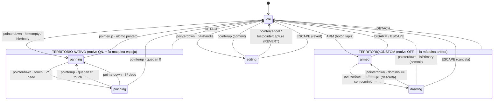

# ADR — Máquina de estados de interacción del chart (pan / drawing / editing / pinch)

- **Fecha:** 2026-07-12 · **Ampliado:** 2026-07-25 (§10–§13)
- **Estado:** §0–§9 **implementadas** (`lib/chartInteractionMachine.js`, `app/useChartInteraction.js`, 44 tests en `tests/chartInteractionMachine.test.js`). §10–§13 **propuestas**, pendientes de revisión.
- **Alcance:** SOLO arbitraje de la interacción existente. Sin persistencia Supabase, sin nuevas herramientas de dibujo, sin tocar `app/api/chart/route.js`, sin reactivar `mouseWheel:true`.
- **Archivos afectados:** `app/useChartDrawings.js`, `app/UniversalPriceChart.jsx` (mínimo), `lib/chartInteractionMachine.js` y `app/useChartInteraction.js`.

> **Nota de la ampliación (2026-07-25).** §0–§9 se dejan intactas: sus hechos H1–H4 están verificados contra el bundle de lightweight-charts v5 y la implementación los respeta. §10–§13 cubren lo que el documento original no trataba — el diagrama de estados, la frontera con el ciclo de vida de React, y las invariantes comprobables — y se redactan **contra el código ya existente en `merge-test/chart-controller`**, no sobre un diseño hipotético.

---

## 0. Hechos técnicos verificados que condicionan el diseño

Estos cuatro hechos están verificados leyendo `node_modules/lightweight-charts/dist/lightweight-charts.development.mjs` (v5) y el código propio. El diseño se cae si alguno se ignora, así que van primero:

**H1 — La librería NO usa Pointer Events.** Su `MouseEventHandler` se suscribe a `mousedown`, `mousemove`, `touchstart`, `touchmove`, `touchend` (líneas ~8310–8423 del bundle de desarrollo), sobre el **canvas superior interno** (`topCanvasBinding.canvasElement`, línea ~9565), en fase bubble.

> Consecuencia: `event.stopPropagation()` sobre `pointerdown`/`pointermove` **no bloquea absolutamente nada** de la librería. `pointerdown` y `mousedown`/`touchstart` son despachos independientes del navegador; detener la propagación de uno no afecta al otro. Cualquier diseño que "arbitre" con stopPropagation de pointer events es un placebo.

**H2 — La librería lee las opciones perezosamente, en el momento del evento.** `handleScroll.pressedMouseMove`, `horzTouchDrag`, `handleScale.pinch`, etc. se evalúan vía closures sobre `chart.options()` cuando el gesto empieza o avanza (líneas ~6473, ~9566–9567), no se cachean al crear el chart.

> Consecuencia: un `chart.applyOptions({ handleScroll: {...}, handleScale: {...} })` **síncrono** dentro de un listener de captura surte efecto antes de que la librería procese el `mousedown`/`touchstart` de ese mismo gesto. Esto ya lo demuestra `captureHandleScroll()` en `useChartDrawings.js:212` — funciona hoy. **Este es el mecanismo canónico de arbitraje**, no los stopPropagation.

**H3 — Orden de despacho garantizado.** Para un mismo contacto, el navegador dispara `pointerdown` **antes** que `mousedown`/`touchstart`. Y nuestros listeners en fase de captura sobre el contenedor se ejecutan antes que los listeners de la librería en su canvas descendiente. Por tanto: todo lo que la máquina decida y aplique síncronamente en su `pointerdown` de captura llega a tiempo.

**H4 — `preventDefault()` sobre `pointerdown` suprime los *compatibility mouse events* (mousedown/mousemove/mouseup sintéticos) solo para punteros táctiles/pen — NO suprime el `mousedown` de un ratón real.** Además, el `touchstart` de la librería está registrado `{passive:true}`, y un `touchstart` real no se suprime cancelando `pointerdown`.

> Consecuencia: `preventDefault` es útil (bloquea selección de texto, y el camino mouse-compat del táctil), pero **nunca es suficiente por sí solo**. El bloqueo fiable en todos los tipos de puntero es H2 (applyOptions).

---

## 1. Decisión en una frase

Una máquina de estados **pura y única** en `lib/chartInteractionMachine.js` (sin React, sin DOM, sin imports de lightweight-charts), consumida por un hook adaptador `app/useChartInteraction.js` que posee **el único juego de listeners pointer en fase de captura** y ejecuta los efectos; el arbitraje del comportamiento nativo se hace **exclusivamente vía `applyOptions` síncrono** al entrar/salir de cada estado, y `useChartDrawings.js` queda reducido a dominio de drawings (store, primitiva, conversión pantalla→dominio) sin listeners DOM propios.

---

## 2. Estados

Seis estados explícitos. `toolActive` e `inProgress` desaparecen como banderas independientes: pasan a ser **derivados** del estado de la máquina (`toolActive ⇔ state ∈ {armed, drawing}`, `inProgress ⇔ state === drawing`), con lo que la clase entera de bugs "banderas incoherentes" deja de poder existir.

| Estado | Significado | Dueño del gesto | Nativo (`handleScroll`/`handleScale`) |
|---|---|---|---|
| `idle` | Sin gesto. Selección de línea posible. | — | **ON** (baseline: `pressedMouseMove:true, horzTouchDrag:true, pinch:true`; wheel siempre false) |
| `armed` | Lápiz activo, p1 aún no colocado. | custom (modal) | **OFF** (todo false, pinch incluido) |
| `drawing` | p1 colocado, esperando p2 (click-click, no drag). | custom (modal) | **OFF** |
| `editing` | Arrastrando un handle de una línea existente. | custom | **OFF** |
| `panning` | La librería ejecuta su drag-to-scroll. | **nativo** | ON |
| `pinching` | La librería ejecuta su pinch táctil de 2 dedos. | **nativo** | ON |

Notas:

- `panning` se entra en el `pointerdown` aunque el usuario no llegue a mover: significa "este press pertenece al nativo", no "hubo desplazamiento". Un click sin movimiento entra y sale de `panning` sin efectos visibles — es correcto y simplifica los guards.
- `armed` y `drawing` son **modales**: mientras el lápiz está activo, el pan y el pinch nativos están deshabilitados por completo. Trade-off asumido: no se puede pan-ear a mitad de dibujo para colocar p2 fuera de pantalla. Es el patrón de TradingView y elimina de raíz la clase de ambigüedad "¿este drag es pan o es dibujo?". La alternativa (pan permitido mientras armed, dibujo solo por click) reintroduce heurísticas de umbral de movimiento que son exactamente la fragilidad que este ADR viene a matar. Si en el futuro hace falta, se añade como transición nueva, no como heurística.
- Hoy `captureHandleScroll()` deshabilita `handleScroll` pero **no** `handleScale.pinch` — durante un drag de handle un segundo dedo puede disparar un pinch nativo. La máquina cierra ese hueco: OFF significa scroll **y** scale (pinch) a false.

### Contexto de la máquina (datos que viajan con el estado)

```
{
  activePointers: Map<pointerId, {pointerType, isPrimary}>,  // bookkeeping propio
  capturedPointerId: number | null,       // solo en editing
  drag: { drawingId, handle, originalPoint } | null,  // solo en editing
  pendingP1: { time, price } | null,      // solo en drawing
  selectedId: string | null
}
```

---

## 3. Tabla de transiciones

Convenciones: `hit` es el resultado de `primitive.pickAt(x,y)` calculado por el **adaptador** (la máquina es pura y no puede hacer hit-test; recibe el evento ya clasificado: `handle | body | empty`). "Swallow" = `preventDefault()` + no procesar. Los efectos `nativeOff`/`nativeOn` son `applyOptions` **síncrono dentro del mismo handler de captura** (H2/H3).

### Desde `idle`

| Evento + guard | → Estado | Efectos |
|---|---|---|
| `ARM` (botón lápiz) | `armed` | `nativeOff`; `touchAction:'none'` en contenedor; deseleccionar; cursor crosshair |
| `pointerdown` · hit=**handle** | `editing` | **1º** `nativeOff` (síncrono, antes de que la librería vea su mousedown/touchstart); `setPointerCapture(pointerId)` sobre el contenedor; guardar `drag` con `originalPoint` (copia del punto actual); seleccionar la línea; `preventDefault` |
| `pointerdown` · hit=**body** | `panning` | Seleccionar la línea. **No** suprimir nada: el nativo puede iniciar pan desde el cuerpo de una línea (v1 no tiene "mover línea entera"; cuando exista, será una transición nueva aquí) |
| `pointerdown` · hit=**empty** | `panning` | Deseleccionar (comportamiento actual, se conserva). No suprimir nada |
| `wheel` | `idle` | Fuera de la máquina — ver §6. Único estado donde el zoom por wheel/trackpad se aplica |

### Desde `panning` (dueño: nativo — la máquina solo observa)

| Evento + guard | → Estado | Efectos |
|---|---|---|
| `pointermove` | `panning` | Ninguno. La librería gestiona el scroll |
| `pointerdown` · pointerType=touch (2º dedo) | `pinching` | **Ninguno.** No suprimir, no cancelar: la librería detecta ella misma `touches.length===2` y promueve el pan a pinch (es su comportamiento interno, línea ~8406). La máquina solo actualiza su bookkeeping para reflejarlo |
| `pointerdown` · pointerType≠touch (2º puntero no táctil, caso raro) | `panning` | Ignorar |
| `pointerup`/`pointercancel` · último puntero | `idle` | Ninguno (nativo ya estaba ON) |

**Respuesta explícita a la pregunta 3 (pan + segundo dedo):** se **promueve a pinching**, no se cancela ni se ignora — porque es lo que la librería ya hace internamente y pelearse con ella requeriría suprimir touchstart, lo que rompería su bookkeeping interno de touches. La máquina espeja, no arbitra, en territorio nativo.

### Desde `pinching` (dueño: nativo)

| Evento + guard | → Estado | Efectos |
|---|---|---|
| `pointerup`/`pointercancel` · quedan ≥1 touch | `panning` | Ninguno (la librería degrada a scroll de 1 dedo sola) |
| `pointerup`/`pointercancel` · quedan 0 | `idle` | Ninguno |
| `pointerdown` (3º dedo) | `panning` | Ninguno — la librería aborta el pinch con `touches.length !== 2`; la máquina espeja |

### Desde `armed`

| Evento + guard | → Estado | Efectos |
|---|---|---|
| `pointerdown` · `isPrimary` (cualquier hit — el lápiz es modal, ignora líneas existentes) | `drawing` | `screenToDomain` → guardar `pendingP1`; `setPendingOverlay({p1, cursor})`; `preventDefault` |
| `pointerdown` · `!isPrimary` (2º dedo) | `armed` | **Swallow.** Sin pinch en modo modal — determinista; el usuario sale con Escape o el botón si quiere hacer zoom |
| `DISARM` (botón) o `Escape` | `idle` | `nativeOn`; restaurar `touchAction`; limpiar overlay |

### Desde `drawing`

| Evento + guard | → Estado | Efectos |
|---|---|---|
| `pointermove` (hover, sin botón — es click-click) | `drawing` | Actualizar `setPendingOverlay` con cursor (lógica actual de `onPointerMove`) |
| `pointerdown` · `isPrimary` · dominio ≠ p1 | `idle` | Commit: `storeAdd(createTrendline(p1,p2))`; limpiar overlay; `nativeOn`; restaurar `touchAction` (el lápiz se apaga tras completar, comportamiento actual) |
| `pointerdown` · `isPrimary` · dominio == p1 (mismo punto exacto) | `armed` | Descartar, limpiar overlay, seguir armado (comportamiento actual de `finishDrawAt`) |
| `pointerdown` · `!isPrimary` | `drawing` | Swallow |
| `Escape` | `idle` | Cancelar: limpiar overlay + `pendingP1`; `nativeOn`; restaurar `touchAction` (= `cancelDraw` actual, que también apaga el lápiz) |
| `DETACH` (recreación del chart / cambio de símbolo) | `idle` | Cancelar dibujo en curso. Sin `applyOptions` (el chart viejo muere); el chart nuevo nace con el baseline de `idle` |

### Desde `editing`

| Evento + guard | → Estado | Efectos |
|---|---|---|
| `pointermove` · `pointerId === capturedPointerId` | `editing` | `screenToDomain` → `storeUpdate` del handle (actualización en vivo, como hoy) |
| `pointermove` · otro pointerId | `editing` | Ignorar |
| `pointerup` · `capturedPointerId` | `idle` | Commit (el store ya tiene la última posición); `releasePointerCapture`; `nativeOn`; limpiar `drag` |
| `pointercancel` / `lostpointercapture` | `idle` | **REVERT**: `storeUpdate` restaurando `drag.originalPoint`. ⚠️ Cambio respecto a hoy: `onPointerUp` actual trata cancel como commit y `originalPoint` (que ya se guarda en `dragStateRef`, línea 335) no se usa nunca. Un pointercancel (p.ej. el SO roba el gesto) debe deshacer, no confirmar a medias |
| `pointerdown` (2º puntero, cualquier tipo) | `editing` | **Swallow.** No promover a pinch a mitad de edición: abortar una acción de precisión del usuario por una señal ambigua es peor que ignorar el dedo extra. El nativo ya está OFF (pinch incluido), así que la librería tampoco lo verá |
| `Escape` | `idle` | Revert a `originalPoint` + fin (mejora recomendada, coste trivial; hoy Escape solo cancela dibujo) |

**Respuesta explícita a la pregunta 3 (editing/armed + segundo dedo):** en territorio custom el segundo puntero se **ignora y se traga** siempre. Solo en territorio nativo (`panning`) se promueve a `pinching`. La regla mnemotécnica para M3: *el nativo espeja, el custom traga*.

---

## 4. Quién bloquea qué, y con qué mecanismo (pregunta 2)

Jerarquía de mecanismos, del canónico al accesorio:

1. **`chart.applyOptions({handleScroll, handleScale})` síncrono** — el único bloqueo fiable para mouse Y touch (H2). Se aplica en las transiciones de entrada/salida de estados custom (`idle→editing`, `idle→armed`, `→idle`). El par `captureHandleScroll`/`restoreHandleScroll` actual se elimina y se reemplaza por este efecto, con dos correcciones: (a) apaga también `handleScale.pinch` y `axisDoubleClickReset`, (b) el "restore" no guarda/restaura un backup — restaura **siempre el baseline nombrado** (ver abajo), eliminando el estado `handleScrollBackupRef` y su copia divergente del baseline en `useChartDrawings.js:236-243`.
2. **`preventDefault()` sobre `pointerdown`** en estados/entradas custom — suprime selección de texto y los mouse-compat del táctil (H4). Necesario pero no suficiente; nunca es el mecanismo primario.
3. **`touch-action` inline en el contenedor** — `'none'` al entrar en `armed`/`editing`, restaurar al salir. Evita que el navegador haga scroll de página / zoom de viewport con gestos que ahora son custom. En `idle` NO se toca: con `vertTouchDrag:false`, el swipe vertical sobre el chart hace scroll de página y eso es comportamiento deseado actual.
4. **`stopPropagation` de pointer events** — solo higiene interna (evitar que otros listeners pointer propios de la app reaccionen). **Prohibido usarlo como mecanismo de arbitraje contra la librería** (H1). M3: no añadir listeners de captura sobre `mousedown`/`touchstart` para "reforzar" — un solo mecanismo (applyOptions) con un solo punto de verdad; dos mecanismos solapados es cómo se llega a los bugs de interleaving que motivan este ADR.

**Baseline nativo nombrado** — extraer a constante compartida (p.ej. en `lib/chartInteractionMachine.js`):

```js
export const NATIVE_GESTURES_ON = {
  handleScroll: { mouseWheel: false, pressedMouseMove: true, horzTouchDrag: true, vertTouchDrag: false },
  handleScale:  { axisPressedMouseMove: false, axisDoubleClickReset: true, mouseWheel: false, pinch: true },
};
export const NATIVE_GESTURES_OFF = {
  handleScroll: { mouseWheel: false, pressedMouseMove: false, horzTouchDrag: false, vertTouchDrag: false },
  handleScale:  { axisPressedMouseMove: false, axisDoubleClickReset: false, mouseWheel: false, pinch: false },
};
```

`createChart` en `UniversalPriceChart.jsx` consume `NATIVE_GESTURES_ON` (hoy ese literal está duplicado en dos archivos con riesgo de deriva). `mouseWheel:false` queda fijado en ambos — intencional, no se toca.

---

## 5. Dónde vive el estado (pregunta 4) — y por qué

**`lib/chartInteractionMachine.js` (nuevo, ~150 líneas):** máquina pura. API:

```js
createChartInteractionMachine() → {
  getState(),                        // 'idle' | 'armed' | 'drawing' | 'editing' | 'panning' | 'pinching'
  send(event) → Effect[],            // transición síncrona; devuelve efectos a ejecutar
  subscribe(fn),                     // notificación de cambio de estado (para UI React)
}
```

Eventos de entrada (ya clasificados por el adaptador): `{type:'pointerdown', pointerId, pointerType, isPrimary, hit, domain}`, `pointermove`, `pointerup`, `pointercancel`, `ARM`, `DISARM`, `ESCAPE`, `DETACH`. Efectos de salida (uniones discriminadas): `nativeOff`, `nativeOn`, `capturePointer`, `releasePointer`, `preventDefault`, `select(id)`, `deselect`, `beginOverlay`, `updateOverlay`, `clearOverlay`, `commitDraw(p1,p2)`, `beginHandleDrag(...)`, `updateHandleDrag(domain)`, `revertHandleDrag`, `setTouchAction(v)`.

Sin React, sin DOM, sin lightweight-charts: testeable en Node con tests de tabla (secuencia de eventos → secuencia de estados+efectos). Esto es lo que hace la decisión no-desechable.

**`app/useChartInteraction.js` (nuevo, ~120 líneas):** adaptador. Posee los **únicos** listeners `pointerdown/move/up/cancel` en captura sobre el contenedor (se mudan desde `useChartDrawings.js:384-425`, que los pierde). Responsabilidades: clasificar el evento (llamar `primitive.pickAt` y `screenToDomain`, ambos inyectados), llamar `machine.send()`, y ejecutar los efectos — `applyOptions` contra el chart, `setPointerCapture` contra el contenedor, y despachar los efectos de dominio a callbacks que `useChartDrawings` registra.

**`app/useChartDrawings.js` (adelgaza):** conserva store, primitiva, `screenToDomain`, overlay, teclado y `toolbarProps`; pierde sus listeners DOM, `toolActive`/`inProgress` como estado propio (los deriva de `machine.subscribe`) y el par capture/restoreHandleScroll. El botón del lápiz pasa a emitir `ARM`/`DISARM`.

**Por qué NO dentro de `useChartDrawings`:** la máquina necesita conocer `panning`/`pinching`, que no son conceptos de drawings. Meterla ahí acopla el árbitro a uno de los arbitrados — exactamente la frontera que P1 quiere cortar. **Por qué NO en `UniversalPriceChart.jsx`:** es el monolito frágil de 1118 líneas que P1 va a desmontar; añadirle responsabilidades profundiza el problema.

**Compatibilidad con P1 (data model / viewport state / interaction mode):** la máquina pura ES la frontera "interaction mode" ya extraída. Cuando se extraiga el chart controller, el controller absorbe el cableado del adaptador (`useChartInteraction` se disuelve en él) y `lib/chartInteractionMachine.js` se mueve intacto — cero rediseño. El efecto `nativeOn/nativeOff` es además el único punto de contacto entre interaction mode y el chart, lo que deja la frontera viewport-state limpia para P1.

---

## 6. El handler de wheel/trackpad — relación con la máquina

`onWheelCaptured` (`UniversalPriceChart.jsx:805`) **no entra en la máquina** — wheel no es un gesto pointer, no tiene ciclo de vida down/move/up, y ya tiene su propio arbitraje correcto vía `stopImmediatePropagation` sobre la cadena `wheel`. Un solo cambio: consulta `machine.getState()` y **solo aplica zoom en `idle`**; en cualquier otro estado sigue tragando el evento (preventDefault + stopImmediatePropagation) pero sin zoomear. Razón: un pinch de trackpad a mitad de un `editing` re-escala las coordenadas bajo el drag y corrompe la posición del handle. En P1, este handler pertenece a la frontera viewport-state, no a interaction mode.

---

## 7. Casos borde con regla fijada (para que M3 no decida nada)

1. **`pointercancel` en `editing` → revert, no commit** (§3). `originalPoint` ya se captura hoy; solo falta usarlo.
2. **Recreación del chart a mitad de gesto** (cambio de símbolo/rango/intervalo dispara el effect destructor de `UniversalPriceChart`): el `detach` emite `DETACH` → la máquina fuerza `idle` y descarta gesto en curso. El chart nuevo nace con `NATIVE_GESTURES_ON` (baseline de `idle`).
3. **Hit-test táctil de handles:** `pickAt` usa tolerancia ~8px (`trendlinePrimitive.js:291`), insuficiente para dedo. El adaptador pasa `pointerType` y `pickAt` acepta tolerancia opcional: 8px mouse/pen, 16px touch. Cambio de 3 líneas, entra en alcance porque sin él `idle→editing` es prácticamente inalcanzable en táctil.
4. **`isPrimary` como filtro de entrada:** en estados custom solo el puntero primario genera transiciones; los no-primarios se tragan. En estados nativos no se filtra (la librería gestiona los suyos).
5. **Teclado:** el listener de `keydown` sigue en `useChartDrawings` pero traduce a eventos de máquina: `Escape` → `send({type:'ESCAPE'})`; Delete/Backspace sigue igual (borrar selección solo es legal en `idle`, guard trivial).
6. **E2E:** exponer `window.__chartInteractionState = machine` (solo dev, junto a `window.__trendlinePrimitive`) para que los scripts de `scripts/e2e/` puedan asertar estados.

## 8. Qué NO cambia

- `mouseWheel:false` en scroll y scale — intencional, fijado en ambos presets del baseline.
- La lógica de `screenToDomain`, el store de `lib/chartDrawings.js`, la primitiva de render y su `pendingOverlay`.
- El pipeline de zoom por botones / `zoomedLogicalRange` / `manualWindow` (viewport state — territorio P1).
- Comportamiento UX visible actual: click-click para dibujar, click en cuerpo selecciona, click en vacío deselecciona, el lápiz se apaga al completar una línea.

## 9. Orden de implementación sugerido para M3

1. `lib/chartInteractionMachine.js` + tests de tabla en Node (secuencias de §3, incluidos los 3 casos multi-pointer y el revert de pointercancel).
2. `app/useChartInteraction.js` (listeners + clasificación + ejecutor de efectos), con `NATIVE_GESTURES_ON/OFF` exportados desde la máquina y consumidos también por `createChart`.
3. Adelgazar `useChartDrawings.js`: quitar listeners DOM y capture/restoreHandleScroll; derivar `toolActive`/`inProgress` de la máquina; registrar callbacks de dominio.
4. Gating del wheel handler por `machine.getState() === 'idle'`.
5. Tolerancia táctil en `pickAt` + `window.__chartInteractionState`.
6. Verificación E2E: los scripts existentes de `scripts/e2e/` (trendlines + zoom/pan) deben pasar sin cambios de aserciones salvo el nuevo revert-on-cancel.

---

# Ampliación 2026-07-25 — §10 a §13

## 10. Diagrama de estados

Dos territorios disjuntos. En **territorio nativo** (verde) la librería es dueña del gesto y la máquina solo espeja su bookkeeping; en **territorio custom** (azul) la máquina es dueña y el nativo está apagado vía `applyOptions`. La frontera se cruza únicamente por `idle`.



**Transiciones ilegales — no existe arco entre territorios salvo por `idle`.** En concreto: `editing → pinching` no existe (el 2º puntero se traga, §3), `armed → panning` no existe (el lápiz es modal), `drawing → editing` no existe (a mitad de dibujo las líneas existentes no son seleccionables), y `panning → editing` no existe (una vez el nativo posee el press, no se le quita a mitad de gesto). Un evento que llega a un estado que no lo espera **se traga sin transición** — nunca lanza, nunca deja el estado a medias. Es la propiedad de totalidad que §12/I3 convierte en test.

`DETACH` es el único arco universal: legal desde los seis estados, con prioridad sobre el `switch` (`chartInteractionMachine.js:155-163`).

---

## 11. Ciclo de vida de React — dónde vive la máquina y por qué (pregunta 5)

### 11.1 Corrección de la premisa

El bug de congelación citado como motivación **no ocurrió en la máquina de interacción**. Se corrigió en `5941767` y vivía en `useChartDataModel`: un `mountedRef` que solo se ponía a `false`, en el cleanup de un effect *unmount-only*, y cuyo cuerpo de montaje nunca lo restauraba a `true`. El doble-invoke de StrictMode disparaba ese cleanup una vez justo tras el montaje inicial, dejando el ref permanentemente en `false`; a partir de ahí todo cambio de rango o intervalo entraba en el guard y volvía antes de hacer fetch — el chart parecía congelado en los primeros datos cargados.

Importa la distinción porque **el patrón, no el módulo, es lo peligroso**, y ese patrón está replicado en la frontera de interacción (§11.3).

### 11.2 Decisión: la máquina vive en un ref del adaptador, una por *mount*, no por *attach*

Implementado en `app/useChartInteraction.js:83-86` (init perezoso sobre `useRef`). La vida de la máquina es la vida del componente; las recreaciones del chart se modelan con `DETACH → idle`, no destruyendo y recreando la máquina.

**Alternativas descartadas:**

| Alternativa | Por qué se descarta |
|---|---|
| Estado de React (`useState`) | Un `setState` por `pointermove` re-renderiza a frecuencia de puntero durante `editing`. Inviable por rendimiento, y además introduce asincronía: la máquina debe resolver la transición **síncronamente** dentro del handler de captura para que el `applyOptions` llegue a tiempo (H2/H3). `useState` no da esa garantía. |
| Singleton a nivel de módulo | Sobrevive a todo, pero **dos charts en la misma página compartirían máquina**. StatsEdge tiene vistas de comparación; sería un bug latente esperando a la primera vista con dos gráficos. |
| Una máquina por *attach* (recrear en cada cambio de rango/temporalidad) | Rompe la identidad del objeto entre attaches: los consumidores de `subscribe()` (`useChartDrawings` deriva `toolActive`/`inProgress` de ahí) tendrían que re-suscribirse en cada cambio de rango, y el lápiz activo se apagaría al cambiar de temporalidad. Ver §13/P1: hay un argumento legítimo en contra que dejo abierto. |
| Un `useRef` cuyo `.current` se reasigna en cada attach | Lo peor de ambos: identidad inestable sin la limpieza de recrear. |

**Consecuencia deliberada:** la máquina **sobrevive al doble-invoke de StrictMode**. React reutiliza la misma instancia de componente en el ciclo simulado mount→unmount→remount, así que los refs persisten y `machineRef.current !== null` en el segundo montaje. Esto es correcto y es lo que se quiere: la máquina no debe reiniciarse por un artefacto de desarrollo.

### 11.3 El riesgo estructural: mismo patrón que el bug de `mountedRef`

En `app/useChartDrawings.js:193-195`:

```js
useEffect(() => () => {
  detach();
}, [detach]);
```

Es un effect **con cuerpo vacío y cleanup que muta estado compartido** — exactamente la forma del bug corregido en `5941767`. `detach()` (líneas 173-191) envía `DETACH` a la máquina y además pone a `null` `primitiveRef`, `chartRef`, `seriesRef` y `containerRef`.

La diferencia con el caso de `useChartDataModel` es que aquí **sí existe una vía de restauración** — `attach()` (línea 123) repuebla esos refs. Pero vive en **otra función, invocada por otro componente** (el controller, ver `app/useChartController.js`). La corrección depende, por tanto, del **orden relativo** entre el cleanup de este effect y el effect de re-attach del controller a través del remount simulado de StrictMode. React no garantiza ese orden entre componentes distintos.

Mitigación presente hoy: `detach` es `useCallback(..., [])`, estable, así que el effect **no** se re-ejecuta en cada cambio de rango — solo en montaje/desmontaje real y en el ciclo simulado de StrictMode. Eso reduce la superficie, no la elimina.

### 11.4 Las tres reglas que fija este ADR

**R1 — Prohibido el patrón "effect con cuerpo vacío + cleanup mutador" en esta frontera.** Si un cleanup invalida un ref, la restauración va en el **cuerpo de montaje del mismo effect**, no en una función hermana ni en otro componente. Un effect debe ser leíble como una transacción cerrada. Esta regla es la generalización del fix `5941767` y es el entregable de gobernanza más importante de §11.

**R2 — `DETACH` debe ser total e idempotente.** Legal desde los seis estados, enviable cualquier número de veces, sin efectos observables cuando ya se está en `idle`. Ya se cumple (`chartInteractionMachine.js:155-163`: se resuelve antes del `switch`, incondicionalmente).

**R3 — Los tres cruces de ciclo de vida se tratan igual: `DETACH` y nada más.**

| Cruce | Qué pasa | Qué debe hacer |
|---|---|---|
| Doble-invoke de StrictMode (solo dev) | Refs persisten; la máquina sobrevive | `DETACH` → `idle`. El chart nuevo nace con `NATIVE_GESTURES_ON` |
| Cambio de rango / temporalidad / símbolo | El controller destruye y recrea el chart; `attachKey` cambia y re-engancha listeners (`useChartInteraction.js:412`) | `DETACH` antes de `chart.remove()` — ya garantizado por el orden del controller |
| HMR | El módulo se reemplaza; el estado de los refs es indefinido | Ver §13/P2: abierto |

### 11.5 Hueco concreto detectado: `DETACH` no emite efectos de limpieza del DOM

`DETACH` devuelve `effects: []` (línea 162). El razonamiento original era correcto para `applyOptions` — el chart viejo muere, no tiene sentido restaurarle las opciones. Pero arrastra dos consecuencias sobre el **contenedor**, que es un `<div>` propiedad de React y **sobrevive** a la recreación del chart:

1. **`touch-action` queda huérfano.** Si se hace `DETACH` estando en `armed` o `editing`, `container.style.touchAction` se quedó en `'none'` (§4.3) y nadie lo restaura. Efecto visible: el scroll de página con el dedo sobre el área del chart deja de funcionar, de forma permanente y silenciosa, hasta un recargado.
2. **La captura de puntero queda huérfana.** Si se hace `DETACH` desde `editing`, no se emite `releasePointer`; los eventos siguen redirigidos a un nodo que puede estar desmontándose.

**Decisión:** `DETACH` debe emitir `[{type:'setTouchAction', payload:''}]` siempre, y además `{type:'releasePointer', pointerId: capturedPointerId}` cuando `capturedPointerId !== null`. **No** debe emitir `nativeOn` (ahí el razonamiento original sigue siendo válido: el chart viejo muere).

El orden actual lo permite: `detach()` llama a `interactionRef.current.detach()` en la línea 176, **antes** de anular `containerRef` en la 187, así que el ejecutor de efectos todavía alcanza el contenedor. Si alguna vez se invierte ese orden, esta corrección deja de funcionar en silencio — anotarlo en el propio `detach()`.

---

## 12. Qué se rompe si esto se implementa mal, y qué invariante lo detecta (pregunta 6)

El rasgo común de todos los fallos de esta frontera es que son **silenciosos**: no lanzan, no aparecen en consola, y los tests unitarios de dominio siguen verdes. El chart simplemente deja de responder. Por eso las invariantes tienen que ser estructurales, no de resultado.

| # | Modo de fallo | Síntoma para el usuario | Invariante que lo detecta |
|---|---|---|---|
| F1 | Fuga de `nativeOff` (se apaga y no se vuelve a encender) | **Chart congelado**: pan y pinch muertos, sin error. El fallo más probable y más caro | **I1** |
| F2 | Estado atascado en `editing`/`drawing`/`armed` | Chart inerte: todos los `pointerdown` se tragan | **I2** |
| F3 | `touch-action:'none'` huérfano (§11.5) | El scroll de página sobre el chart muere | **I5** |
| F4 | Captura de puntero huérfana | Eventos dirigidos a un nodo desmontado; posible fuga de memoria | **I4** |
| F5 | Máquina reiniciada donde no debía | El lápiz se apaga solo al cambiar rango/temporalidad | **I6** |
| F6 | Puntero fantasma en `activePointers` | Nunca se vuelve a `idle`; el siguiente gesto arranca en el estado equivocado | **I2** |

### Invariantes

Las seis son comprobables **sin DOM y sin navegador**, sobre la máquina pura — que es precisamente lo que justifica haberla extraído.

- **I1 — Balance de gestos nativos.** Llevando un contador que suma en cada `nativeOff` y resta en cada `nativeOn`: `state === 'idle' ⟹ contador === 0`. Es la invariante que atrapa el chart congelado (F1) y la más valiosa de las seis. Se comprueba como *property test*: sobre secuencias aleatorias de eventos, tras cada transición a `idle`, aserción del contador.
- **I2 — No hay estados huérfanos.** Para toda secuencia de eventos que termine con todos los punteros levantados (`activePointers.size === 0`), el estado final es `idle`. Property test con secuencias generadas, incluyendo intercalados de `pointercancel` y `lostpointercapture`.
- **I3 — Totalidad y `DETACH`.** (a) Para todo estado × todo tipo de evento, `send()` devuelve un estado válido y no lanza — ningún par (estado, evento) queda sin definir. (b) Para los seis estados, `send({type:'DETACH'})` da `idle` con contexto vacío, y un segundo `DETACH` no produce efectos adicionales. Test de tabla exhaustivo, 6 × N celdas.
- **I4 — La captura no sobrevive a `editing`.** `capturedPointerId !== null ⟺ state === 'editing'`. Aserción tras cada transición en todos los tests.
- **I5 — `touch-action` restaurado.** `state === 'idle' ⟹ el último efecto de touchAction emitido fue de restauración`. Requiere el cambio de §11.5; hoy falla por `DETACH`.
- **I6 — Supervivencia al ciclo de vida.** Simulando mount → unmount → remount (el ciclo de StrictMode) y a continuación un `ARM` + secuencia completa de dibujo: la línea debe comitearse. Es la regresión directa de la clase `5941767`, y es la única de las seis que necesita un test con React (`@testing-library/react` con `<StrictMode>`), no solo la máquina pura.

### Estado actual de la cobertura

`tests/chartInteractionMachine.test.js` tiene **44 casos**, todos de tabla estado-por-estado, y 8 tocan `DETACH`. Cubren bien la corrección *por transición*. **No hay ninguno de las seis invariantes anteriores**: cero property tests, cero tests de ciclo de vida (`grep` de `StrictMode|remount|HMR` da cero). Cerrar §12 es, sobre todo, añadir I1, I2 e I6 — las tres que cubren los modos de fallo silenciosos.

---

## 13. Preguntas abiertas — decisiones que NO tomo aquí

**P1 — ¿Máquina por *mount* o por *attach*?** §11.2 documenta lo construido (por mount) y su justificación es sólida, pero el contra-argumento es real: una máquina por attach hace **imposible por construcción** que un estado sobreviva a una recreación del chart, en vez de depender de que `DETACH` se envíe correctamente en todos los caminos. Es la diferencia entre "no puede pasar" y "no pasa si el cableado es correcto". El coste es re-suscripción en cada cambio de rango y el lápiz apagándose al cambiar de temporalidad. **Trade-off: robustez estructural contra continuidad de UX.** No lo resuelvo unilateralmente porque depende de cuánto valga el lápiz persistente entre temporalidades, que es criterio de producto.

**P2 — HMR.** Es el único de los tres cruces de §11.4 sin regla. Dos opciones legítimas: (a) forzar reset completo en cada hot-update mediante `import.meta.hot.dispose` (determinista, pero se pierde el dibujo en curso en cada guardado — molesto justo cuando se está iterando sobre el código de dibujo); (b) no hacer nada y aceptar que HMR sobre estos dos módulos puede dejar estado incoherente, con la instrucción de recargar a mano. Dado que solo afecta a desarrollo, **(b) con una nota en el módulo es defendible** y (a) es más trabajo del que parece. Necesita tu criterio, no el mío.

**P3 — `AGENTS.md` no existe.** `CLAUDE.md` lo cita como fuente de gobernanza técnica que Codex lee, pero no está en el árbol de trabajo ni en el historial de ninguna rama (`git log --all -- AGENTS.md` vacío). O vive fuera del repo, o la referencia está obsoleta. Si contiene restricciones de diseño aplicables a esta frontera, §10–§13 no han podido tenerlas en cuenta.

**P4 — Fragmentación de ramas.** Esta ampliación se redactó contra `merge-test/chart-controller`, donde la máquina está implementada y trackeada. `CLAUDE.md` advierte que el refactor del chart está fragmentado en al menos cuatro ramas. Si §0–§9 se implementaron de forma divergente en `refactor/chart-controller-extraction` o `codex/statsedge-ui-polish`, las referencias a líneas concretas de §11 y §12 no son válidas ahí.
